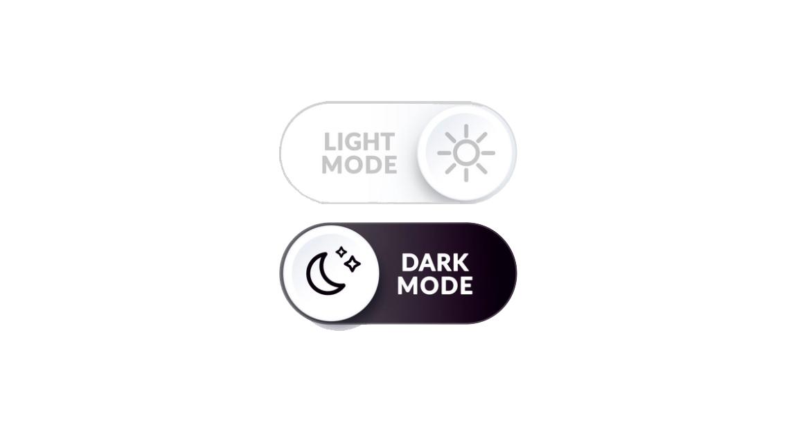
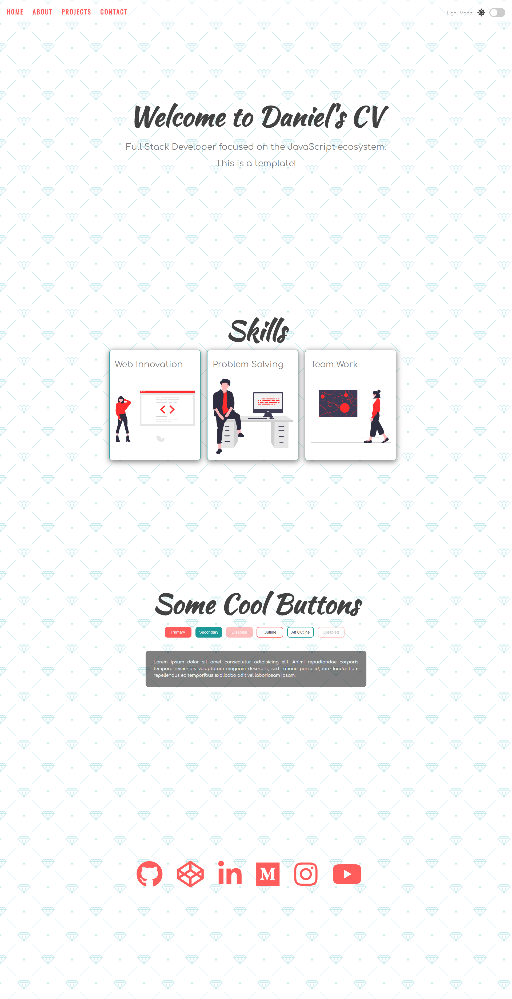
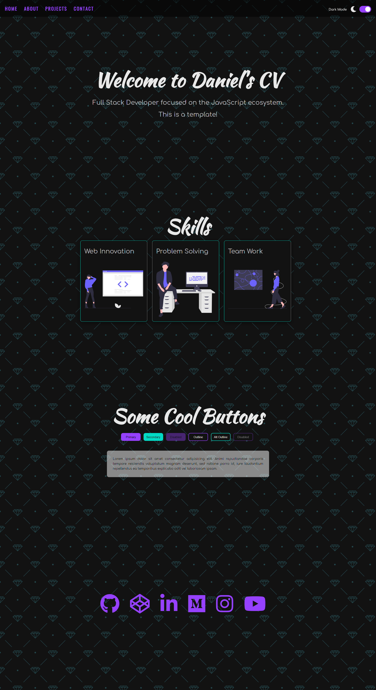

 

# template-CV2-light-dark-mode

## Built With

* [HTML](https://en.wikipedia.org/wiki/HTML)
* [Css](https://en.wikipedia.org/wiki/CSS)
* [Javascript](https://www.javascript.com)

## Light Mode

 

## Dark Mode

 
